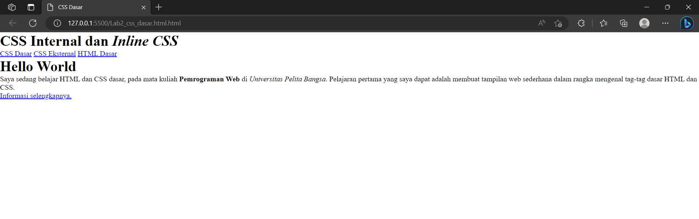
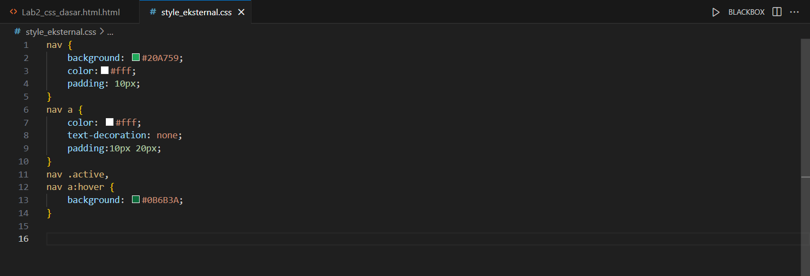
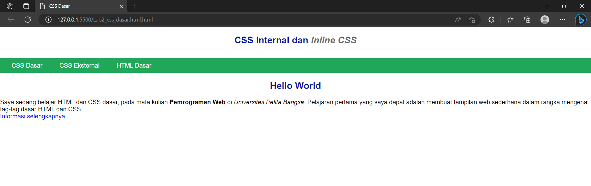
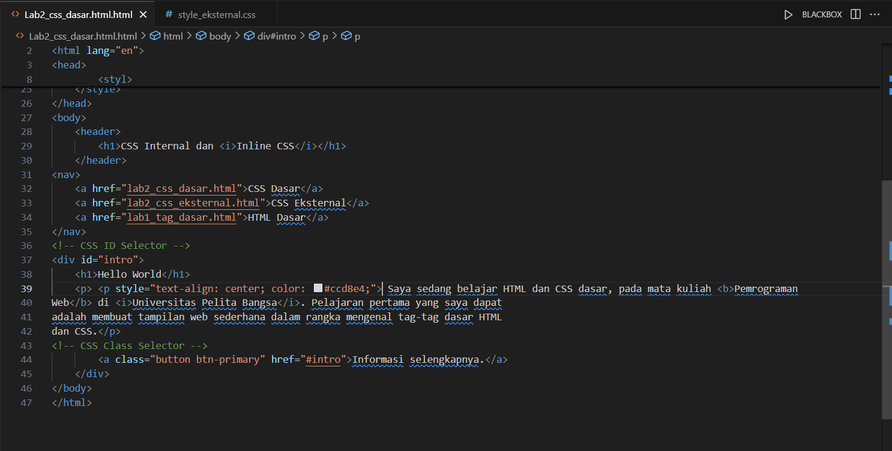
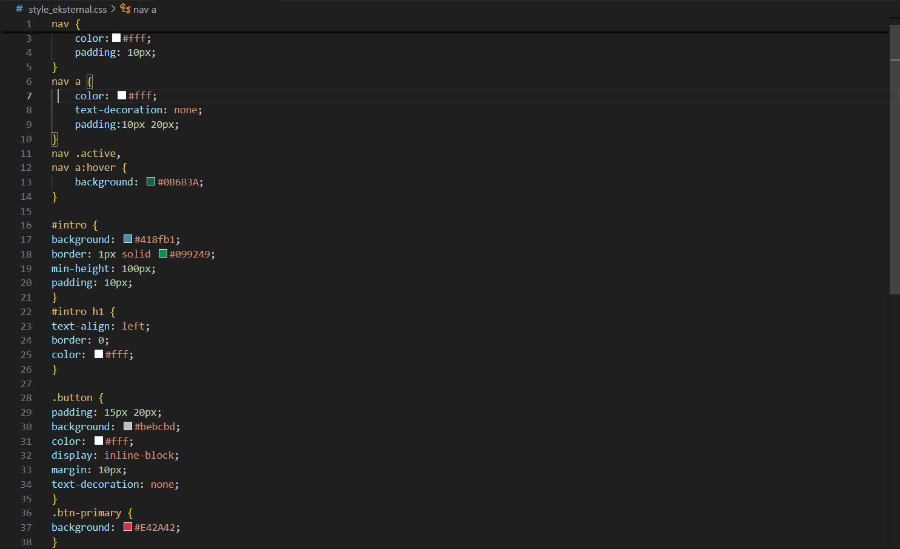
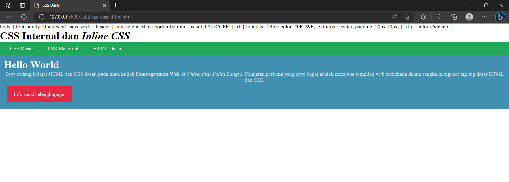

# Lab2Web
Nama: Den Fahmi Satria <p>
Nim: 312410523 <p>
Kelas: TI.24.A5 <p>
### Membuat CSS Dasar di Dalam HTML
Code Pada File HTML <p>
```
<!DOCTYPE html>
<html lang="en">
<head>
    <meta charset="UTF-8">
    <meta name="viewport" content="width=device-width, initial-scale=1.0">
    <title>CSS Dasar</title>
<link rel="stylesheet" href="style_eksternal.css" type="text/css">
        <styl>
        body {
            font-family:'Open Sans', sans-serif;
        }
        header {
            min-height: 80px;
            border-bottom:1px solid #77CCEF;
        }
        h1 {
            font-size: 24px;
            color: #0F189F;
            text-align: center;
            padding: 20px 10px;
        }
        h1 i {
            color:#6d6a6b;
        }
    </style>
</head>
<body>
    <header>
        <h1>CSS Internal dan <i>Inline CSS</i></h1>
    </header>
<nav>
    <a href="lab2_css_dasar.html">CSS Dasar</a>
    <a href="lab2_css_eksternal.html">CSS Eksternal</a>
    <a href="lab1_tag_dasar.html">HTML Dasar</a>
</nav>
<!-- CSS ID Selector -->
<div id="intro">
    <h1>Hello World</h1>
    <p> <p style="text-align: center; color: #ccd8e4;"> Saya sedang belajar HTML dan CSS dasar, pada mata kuliah <b>Pemrograman
Web</b> di <i>Universitas Pelita Bangsa</i>. Pelajaran pertama yang saya dapat
adalah membuat tampilan web sederhana dalam rangka mengenal tag-tag dasar HTML
dan CSS.</p>
<!-- CSS Class Selector -->
        <a class="button btn-primary" href="#intro">Informasi selengkapnya.</a>
</body>
</html>
```
#### Code Pada File CSS
```
nav {
    background: #20A759;
    color:#fff;
    padding: 10px;
}
nav a {
    color: #fff;
    text-decoration: none;
    padding:10px 20px;
}
nav .active,
nav a:hover {
    background: #0B6B3A;
}

#intro {
background: #418fb1;
border: 1px solid #099249;
min-height: 100px;
padding: 10px;
}
#intro h1 {
text-align: left;
border: 0;
color: #fff;
}

.button {
padding: 15px 20px;
background: #bebcbd;
color: #fff;
display: inline-block;
margin: 10px;
text-decoration: none;
}
.btn-primary {
background: #E42A42;
}
    </div>
```
Saya membuat terlebih dahulu dokumen HTML
 <p>
Kemudian saya jalankan Program nya dan begini hasil nya di chrome <p>
 <p>
Lalu saya tambahkan stylesheet dengan link yang terhubung dengan file CSS yang baru saya buat,code saya taruh di dalam Head. <p>
 <p>
 <p>
Dan seperti ini hasilnya ketika code dijalankan
 <p>
Kemudian saya mengganti warna pada paragraf menjadi abu-abu dengan code <p>
```
<p style="text-align: center; color: #ccd8e4;">
```
 <p>
kemudian saya menambahkan CSS Selector pada file CSS saya
 <p>
Dengan menambahkan code-code diatas, maka hasilnya menjadi seperti ini
 <p>
### Soal 
1. Lakukan eksperimen dengan mengubah dan menambah properti dan nilai pada kode CSS
dengan mengacu pada CSS Cheat Sheet yang diberikan pada file terpisah dari modul ini. <p>
2. Apa perbedaan pendeklarasian CSS elemen h1 {...} dengan #intro h1 {...}? berikan
penjelasannya! <p>
3. Apabila ada deklarasi CSS secara internal, lalu ditambahkan CSS eksternal dan inline CSS pada
elemen yang sama. Deklarasi manakah yang akan ditampilkan pada browser? Berikan
penjelasan dan contohnya! <p>
4. Pada sebuah elemen HTML terdapat ID dan Class, apabila masing-masing selector tersebut
terdapat deklarasi CSS, maka deklarasi manakah yang akan ditampilkan pada browser?
Berikan penjelasan dan contohnya!
```
( <p id="paragraf-1" class="text-paragraf"> )
```
### Jawaban
1. saya menambahkan intro, button, dan teks navigasi pada file style eksternal css berikut code nya
```
    #intro {
    background: #418fb1;
    border: 1px solid #099249;
    min-height: 100px;
    padding: 10px;
    /* Properti Baru */
    border-radius: 15px; /* Sudut tumpul */
}
/* Menargetkan paragraf di dalam #intro */
#intro p {
    line-height: 1.6; /* Jarak antar baris */
}
.button {
    /* ... properti asli ... */
    /* Properti Baru */
    box-shadow: 3px 3px 5px #888888; /* Efek bayangan */
}
nav a {
    /* ... properti asli ... */
    /* Properti Baru */
    text-transform: uppercase; /* Ubah ke huruf besar */
}
```
Dengan melakukan eksperimen ini dan menjalankannya, saya sedang mempraktikkan bagaimana CSS bekerja secara langsung untuk memanipulasi layout dan styling elemen HTML. Tampilan web Saya sekarang menjadi lebih dinamis dan estetik. <p>
2. h1 {...} (Selektor Elemen Biasa):
Sifatnya Global. Jika saya punya sepuluh h1, semuanya akan terpengaruh.
Dalam kode saya, ini akan memengaruhi (h1) CSS Internal dan 
```
...</h1> (di dalam <header>) dan <h1>Hello World</h1> (di dalam #intro).
```
#intro h1 {...}
(Selektor Lebih Spesifik): <p>
Sifatnya Lokal. Ini seperti bilang, "Aku cuma mau ubah h1 yang ada di dalam kotak #intro."
Karena #intro adalah ID (yang seharusnya unik), selektor ini menjadi sangat spesifik.
Dalam kode kamu, ini hanya akan memengaruhi 
```
<h1>Hello World</h1>, sementara <h1>CSS Internal dan...</h1>
```
(di header) tetap menggunakan gaya dari Internal CSS yang kamu buat di 
```
<style> tag.
```
3. Saat ada konflik gaya pada satu elemen, CSS punya aturan main yang disebut Cascading Order (Urutan Berjenjang). Urutan yang akan ditampilkan adalah:
```
Inline CSS>Internal CSS>External CSS
```
Urutan Prioritas (Paling Tinggi ke Paling Rendah): <p>
Inline CSS (Paling Tinggi): Deklarasi gaya yang ditulis langsung di dalam tag HTML menggunakan atribut style="". Ini adalah paling dekat dengan elemen. <p>
Internal CSS: Deklarasi di dalam tag <style> di bagian (head) HTML. <p>
External CSS (Paling Rendah): Deklarasi di file terpisah (.css) yang dihubungkan melalui tag (link). <p>
4. Ini adalah kasus khusus dari Spesifisitas. Ketika sebuah elemen punya ID dan Class, dan keduanya menargetkan properti yang sama, yang akan ditampilkan adalah properti dari ID Selector.
```
ID Selector>Class Selector
```
Perhitungan Spesifisitas (Mudah): <p>
Spesifisitas dihitung berdasarkan poin. Semakin tinggi poin, semakin tinggi prioritasnya: <p>
- ID Selector (#): Mendapat 100 Poin. <p>
- Class Selector (.): Mendapat 10 Poin. <p>
- Element Selector (p): Mendapat 1 Poin. <p>
- Inline Style (style=""): Mendapat 1000 Poin (Ini pengecualian, makanya selalu menang). <p>
Contoh Penerapan pada
```
<p id="paragraf-1" class="text-paragraf">
```
Maka akan jadi begini code nya :
```
/* Class Selector: Poin 10 */
.text-paragraf {
    color: blue;
    font-size: 16px; 
}
/* ID Selector: Poin 100 */
#paragraf-1 {
    color: red;
    font-size: 20px; /* Properti baru */
}
```
Hasil yang Tampil: <p>
Warna Teks (color): Akan menjadi Merah (red), karena deklarasi dari #paragraf-1 (100 poin) mengalahkan deklarasi dari .text-paragraf (10 poin). <p>
Ukuran Font (font-size): Akan menjadi 20px, karena hanya font-size dari ID yang dideklarasikan, meskipun jika keduanya dideklarasikan, ID tetap menang. <p> 
Intinya: Dalam persaingan ketat, ID selalu mengungguli Class karena ID secara desain dimaksudkan untuk elemen yang unik, sehingga memiliki bobot lebih tinggi dalam hierarki CSS. <p>
