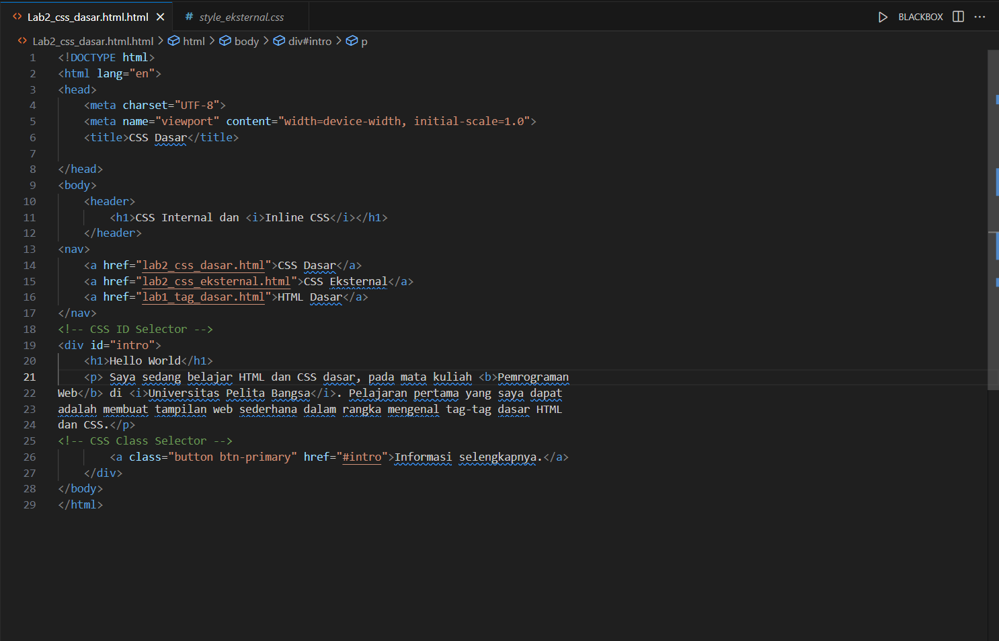
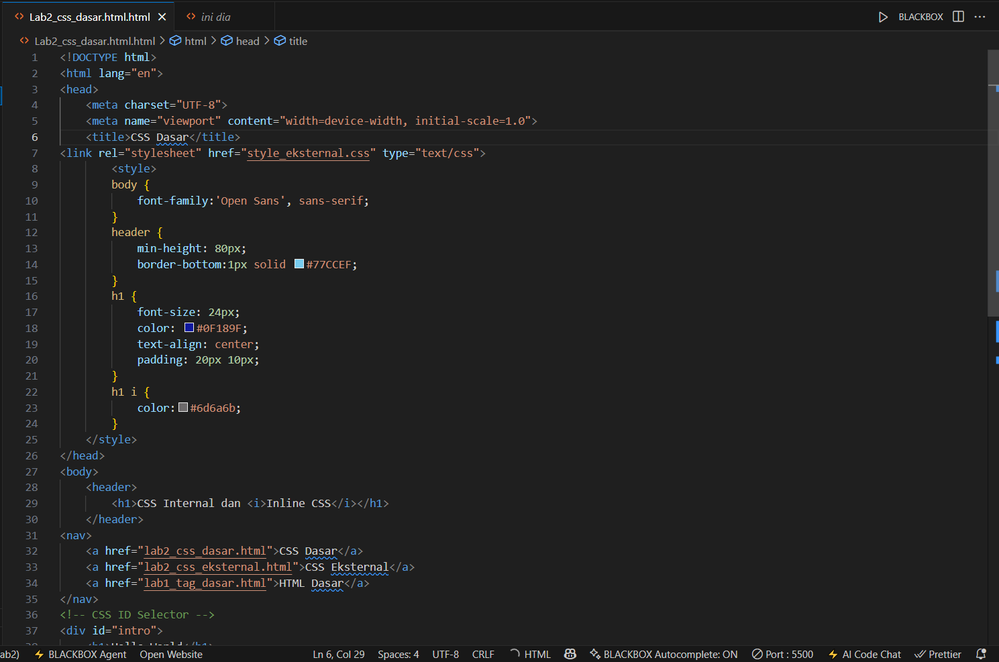

# Lab2Web
Nama: Den Fahmi Satria <p>
Nim: 312410523 <p>
Kelas: TI.24.A5 <p>
#### Membuat CSS Dasar di Dalam HTML
Code Pada File HTML <p>
```
<!DOCTYPE html>
<html lang="en">
<head>
    <meta charset="UTF-8">
    <meta name="viewport" content="width=device-width, initial-scale=1.0">
    <title>CSS Dasar</title>
<link rel="stylesheet" href="style_eksternal.css" type="text/css">
        <styl>
        body {
            font-family:'Open Sans', sans-serif;
        }
        header {
            min-height: 80px;
            border-bottom:1px solid #77CCEF;
        }
        h1 {
            font-size: 24px;
            color: #0F189F;
            text-align: center;
            padding: 20px 10px;
        }
        h1 i {
            color:#6d6a6b;
        }
    </style>
</head>
<body>
    <header>
        <h1>CSS Internal dan <i>Inline CSS</i></h1>
    </header>
<nav>
    <a href="lab2_css_dasar.html">CSS Dasar</a>
    <a href="lab2_css_eksternal.html">CSS Eksternal</a>
    <a href="lab1_tag_dasar.html">HTML Dasar</a>
</nav>
<!-- CSS ID Selector -->
<div id="intro">
    <h1>Hello World</h1>
    <p> <p style="text-align: center; color: #ccd8e4;"> Saya sedang belajar HTML dan CSS dasar, pada mata kuliah <b>Pemrograman
Web</b> di <i>Universitas Pelita Bangsa</i>. Pelajaran pertama yang saya dapat
adalah membuat tampilan web sederhana dalam rangka mengenal tag-tag dasar HTML
dan CSS.</p>
<!-- CSS Class Selector -->
        <a class="button btn-primary" href="#intro">Informasi selengkapnya.</a>
</body>
</html>
```
#### Code Pada File HTML
```
nav {
    background: #20A759;
    color:#fff;
    padding: 10px;
}
nav a {
    color: #fff;
    text-decoration: none;
    padding:10px 20px;
}
nav .active,
nav a:hover {
    background: #0B6B3A;
}

#intro {
background: #418fb1;
border: 1px solid #099249;
min-height: 100px;
padding: 10px;
}
#intro h1 {
text-align: left;
border: 0;
color: #fff;
}

.button {
padding: 15px 20px;
background: #bebcbd;
color: #fff;
display: inline-block;
margin: 10px;
text-decoration: none;
}
.btn-primary {
background: #E42A42;
}
    </div>
```
Saya membuat terlebih dahulu dokumen HTML
 <p>
Kemudian saya jalankan Program nya dan begini hasil nya di chrome <p>
 <p>
Lalu saya tambahkan stylesheet dengan link yang terhubung dengan file CSS yang baru saya buat,code saya taruh di dalam Head. <p>
 <p>
 <p>
Dan seperti ini hasilnya ketika code dijalankan
 <p>
Kemudian saya mengganti warna pada paragraf menjadi abu-abu dengan code <p>
```
<p style="text-align: center; color: #ccd8e4;">
```
 <p>
kemudian saya menambahkan CSS Selector pada file CSS saya
 <p>
Dengan menambahkan code-code diatas, maka hasilnya menjadi seperti ini
 <p>
